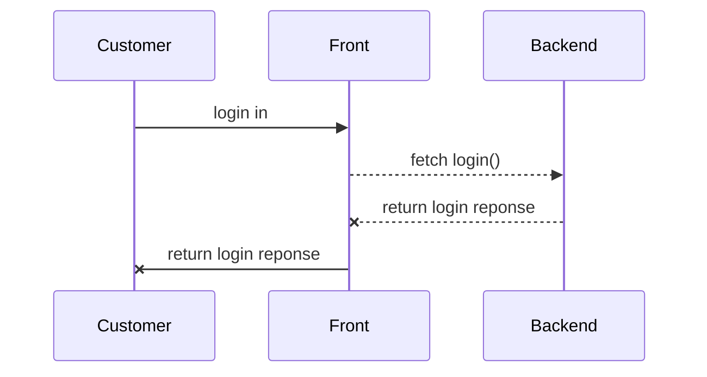

# Background

Hi, everyone! I am trying to build a backend server for tire business demo.

# Timezone

The most important thing is the timezone. Threre are some places to set it. At here, I set it to 'America/Vancouver', but you can set it to another value. You can seek your own timezone at https://www.zeitverschiebung.net/en/.

## Postgresql

At the $POSTGRESQL_HOME/data/postgresql.conf >>>
timezone = 'America/Vancouver'

## Backend Server

At the $PROJECT_HOME/.env >>>
TZ="America/Vancouver"

# Restful API

In the backend server, all APIs are restful with JSON payload. This way would make our system more compatible.

## Express

I use the Express framework as the base of backend server. It bring us more flexibility.

## TypeScript

The codes are almost written using TypeScript, that make our codes are high quality with less bugs.

## Communication Sequence

## Rules on roles

1, Only root can create/delete administrators.
1, Platform don't connect to the merchant's business
2, Everyone has a first-level role, which is set in the u_users with account's creating. 
3, If the user is a merchant, he maybe

## Deploy on Vercel

https://dev.to/tirthpatel/deploy-node-ts-express-typescript-on-vercel-284h

# Contact

Hyman Hsu's email : hymanhsu8175@gmail.com
